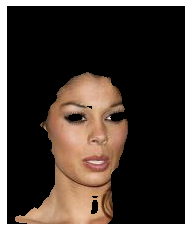
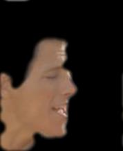
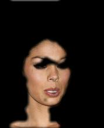
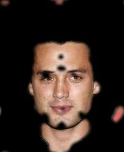

Final work of Image Processing (SCC0251) of the Computer Science course at USP São Carlos.  

Bruna Magrini da Cruz  
Gabriel Francischini de Souza  
Julia Carolina Frare Peixoto    
Marcus Vinicius Medeiros Pará    

# Skin Detection in Face Images

## Definition and Objective

In Skin Detection, the aim is to find skin tone pixels and regions in an image or a video. This process is usually used to detect regions with human faces or limbs on images, to be then be analyzed by a skin classifier (that will tell if the pixel is a skin or nonskill pixel) and human presence or recognition on videos.

With this brief definition in mind, <ins>this project goal is to detect a person's skin in an image that contains a face and return an image with just the skin.</ins> We will achieve it by setting boundaries, converting to HSV and applying a mask. (See Steps)

We are not considering aspects of blocking (faces covered by a mask or intense make-up), recognition (defaced faces by distortions) or any kind of lossy data. Therefore, any skin detected with these obstacles on the face will be just a gain for the main objective. Additionally, it is worth to mention that we are using the CelebA dataset and in this dataset every image contains only one face per image, so multiple faces is not something we are dealing with.

In the final report, we tried to reproduce the face detection, because we were having some false-positive areas on the image, but the results weren't as satisfactory as we planned, so we left two versions of the python project available, one without face detection and one with face detection.

On the instructions below it is described how we collect the images from the dataset, the step-by-step on how to detect the skin and the future implementations:

## Input images

The application input is images of faces. 

The source of the images is the CelebFaces Attributes Dataset (CelebA). CelebA is a large-scale face attributes dataset with more than 200K celebrity images, each with 40 attribute annotations. 

The images in this dataset cover large pose variations and background clutter. CelebA has large diversities, large quantities, and rich annotations, including:
- 10,177 number of identities;
- 202,599 number of face images;
- 5 landmark locations, 40 binary attributes annotations per image.

The complete list of facial attributes provided by CelebA is:

Some examples of CelebA images are:

More information about CelebA can be found on: https://mmlab.ie.cuhk.edu.hk/projects/CelebA.html and https://www.kaggle.com/jessicali9530/celeba-dataset/version/2.

## Steps

To achieve our results we're using image segmentation and color image processing techniques. The steps are the following:

1. Importing libraries

The first step, of course, is to import the necessary libraries, which, in this case, are imageio, numpy and matplotlib.

2. Reading input

After that, it's necessary to take input and convert it to a useable format. In this step, we read the filename and use the function `imread` from the imageio library to store it in an 2D array of integers that range from 0 to 255. We're going to use this array to modify the image and get the information that we need.

3. Face detection

The current approach that we're using here is quite limited. It's only able to detect skintones in a very limited color range that was set in the code. To improve on that, we tried to implement face detection methods in order to detect the subject's actual skintone range, instead of using fixed bounds. As mentioned before, the results for face detection were not as satisfactory as we planned, so we left both codes to comparison. The difference of both approaches can be seem on Results.

4. Setting bounds, converting to HSV and creating the skin mask

Now we set upper and lower bounds for the skintone HSV values. Then, we convert the image's pixels from an RGB to an HSV format. All these variables are then used to create the skin mask, which basically filters which points of the converted image are within the bounds that we set and returns a new image based on that. This image is supposed to be a binary separation of which points of the image are skin and which of them are not skin. Finally, we pass the new image through a median filter.

5. Erosions, dilations and Gaussian blur

With the current method, it's possible that we end up detecting many false-positive regions. In order to remove these regions, we intend to implement an elliptical structuring kernel that will perform erosions and dilations on the mask. The erosions should remove the false-positives by making them disappear from the mask, while the dilations/closing should remove the holes in the remaining parts of the mask. After that, we'll apply Gaussian blur to the mask to give it a smoother look and remove any remaining holes.

6. Applying mask over the original image

In this last step, we just use a multiply function to apply the face mask over the original image. The output is an image that shows only the part of the original image that represents the skintone.

## Results

The first script was able to get the following results.

The final script was able to get the following results.

As the images show, it turns out the final results weren't as good as expected. In fact, they turned out worse than the results obtained with the initial script.

## Roles

Bruna Magrini da Cruz - Implementing erosions, dilations and modularizing code  

Gabriel Francischini de Souza - Implementing functions to read the CelebA database

Julia Carolina Frare Peixoto - Implementing gaussian blur

Marcus Vinicius Medeiros Pará - Implementing face detection
