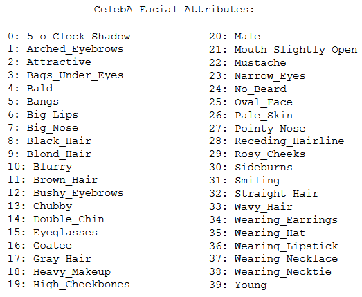
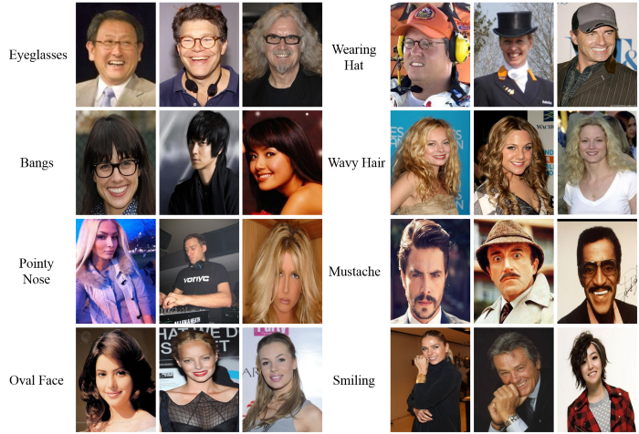

Final work of Image Processing (SCC0251) of the Computer Science course at USP São Carlos.  

Bruna Magrini da Cruz  
Gabriel Francischini de Souza  
Julia Carolina Frare Peixoto    
Marcus Vinicius Medeiros Pará    

# Skin Detection in Face Images

## Definition and Objective

In Skin Detection, the aim is to find skin tone pixels and regions in an image or a video. This process is usually used to detect regions with human faces or limbs on images, to be then be analyzed by a skin classifier (that will tell if the pixel is a skin or nonskill pixel) and human presence or recognition on videos.

With this brief definition in mind, <ins>this project goal is to detect a person's skin in an image that contains a face and return an image with just the skin.</ins>
We are not considering aspects of blocking (faces covered by a mask), recognition (defaced faces by distortions) or any kind of lossy data. Therefore, any skin detected with these obstacles on the face will be just a gain for the main objective. It is worth to mention that we are using the CelebA dataset and in this dataset every image contains only one face, so multiple faces is not something we are dealing with. We are also using OpenCV library.

On the instructions below it is described how we collect the images from the dataset and the step-by-step on how to detect the skin:

## Input images

The application input is images of faces. 

The source of the images is the CelebFaces Attributes Dataset (CelebA). CelebA is a large-scale face attributes dataset with more than 200K celebrity images, each with 40 attribute annotations. 

The images in this dataset cover large pose variations and background clutter. CelebA has large diversities, large quantities, and rich annotations, including:
- 10,177 number of identities;
- 202,599 number of face images;
- 5 landmark locations, 40 binary attributes annotations per image.

The complete list of facial attributes provided by CelebA is:

Some examples of CelebA images are:

More information about CelebA can be found on: https://mmlab.ie.cuhk.edu.hk/projects/CelebA.html and https://www.kaggle.com/jessicali9530/celeba-dataset/version/2.

## Steps

To achieve our results we're using image segmentation and color image processing techniques. The steps are the following:

1. Importing libraries

The first step, of course, is to import the necessary libraries, which, in this case, are imageio, numpy and matplotlib.

2. Reading input

After that, it's necessary to take input and convert it to a useable format. In this step, we read the filename and use the function `imread` from the imageio library to store it in an 2D array of integers that range from 0 to 255. We're going to use this array to modify the image and get the information that we need.

3. Setting bounds, converting to HSV and creating the skin mask

Now we set upper and lower bounds for the skintone HSV values. Then, we convert the image's pixels from an RGB to an HSV format. All these variables are then used to create the skin mask, which basically filters which points of the converted image are within the bounds that we set and returns a new image based on that. This image is supposed to be a binary separation of which points of the image are skin and which of them are not skin. Finally, we pass the new image through a median filter.

4. Applying mask over the original image

In this last step, we just use a multiply function to apply the face mask over the original image. The output is an image that shows only the part of the original image that represents the skintone.

## First results
